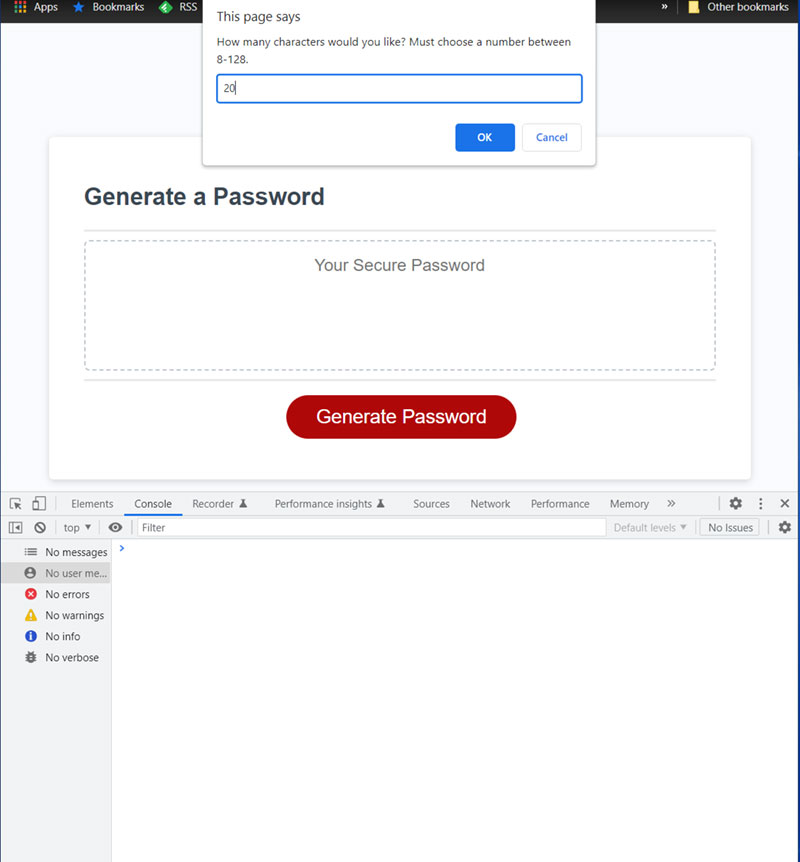
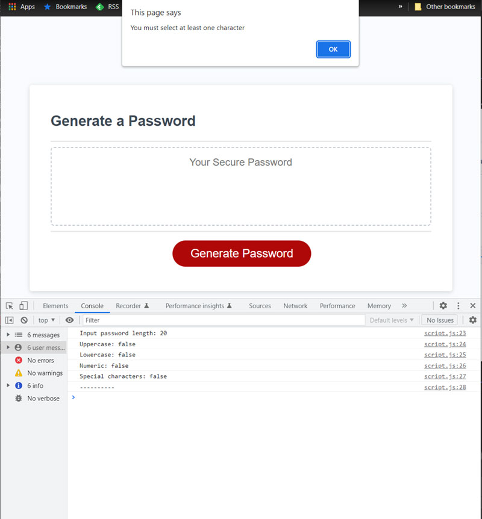
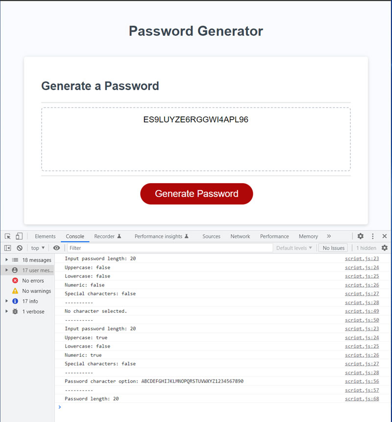

# 03 Password Generator

## Description

Create an application that an employee can use to generate a random password based on criteria they've selected.

## Installation

Click here: https://ebonygrrl.github.io/03-password-generator/

## Usage

To use this application:
1. Click the red button that says "Generate Password".
2. Enter desired length of password between 8 and 128 characters. Press 'OK'.
3. Would you like to use uppercase characters? Press 'OK' for yes. Press 'Cancel' for no.
4. Would you like to use lowercase characters? Press 'OK' for yes. Press 'Cancel' for no.
5. Would you like to use numeric characters? Press 'OK' for yes. Press 'Cancel' for no.
6. Would you like to use special characters? Press 'OK' for yes. Press 'Cancel' for no.
   
Prompt for password length

You must select at least one character criteria

Final password output based on length and selected criteria

## Credits

N/A

## License

Please refer to the LICENSE in the repo.
